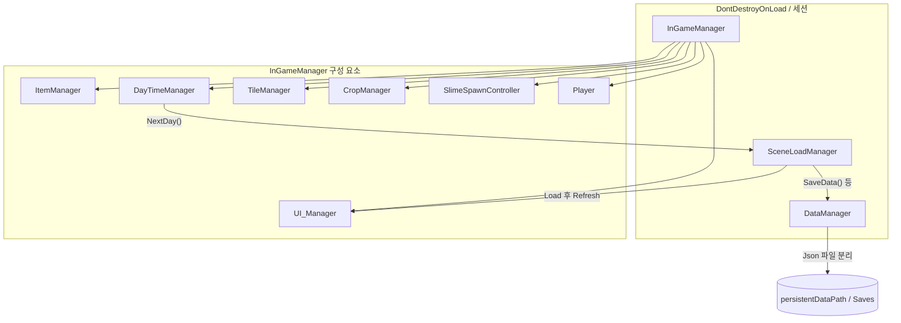
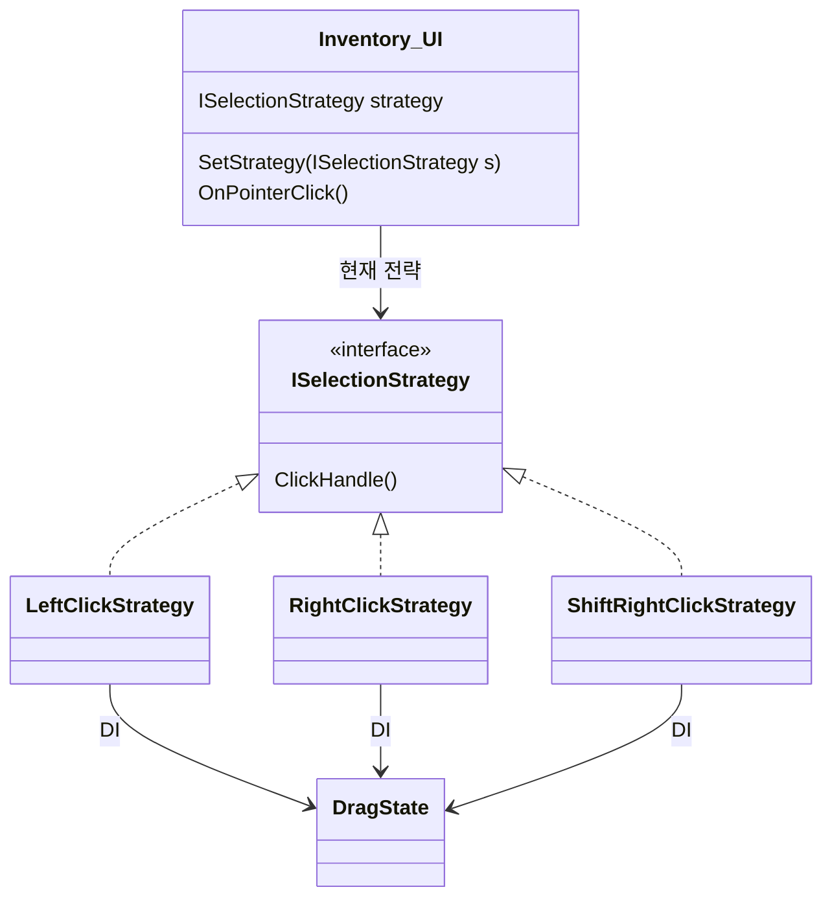
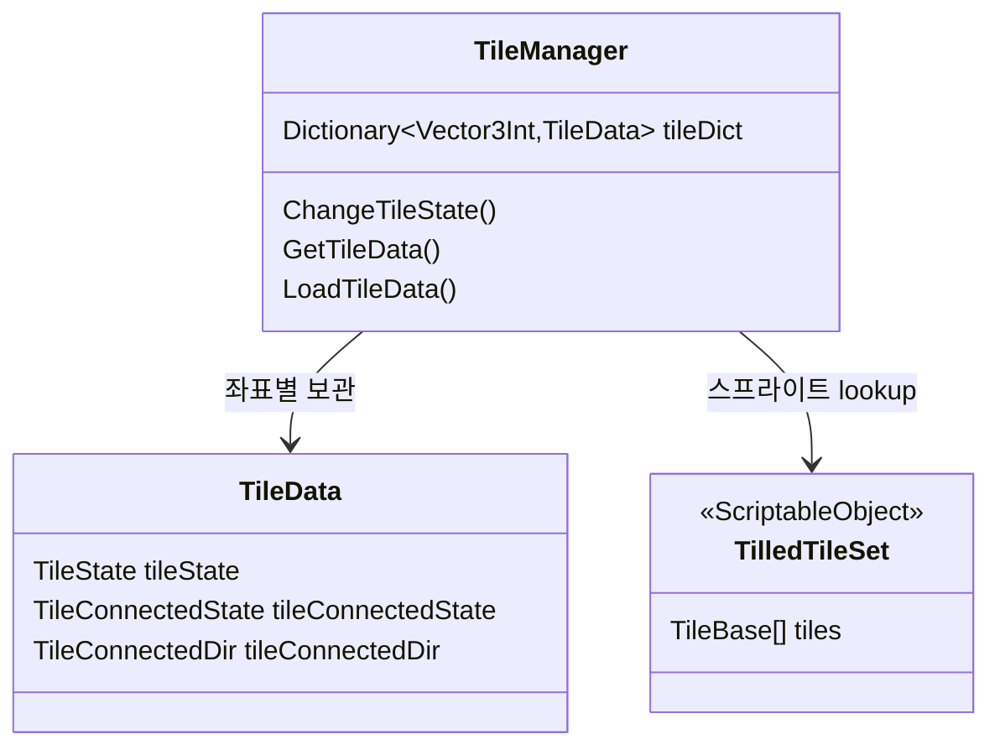

# MiniFarm

---

## Project Overview
- 타일맵으로 경작지를 관리하고 작물을 심고 수확하는 2D 타일 기반 농장 시뮬레이션. 하루 단위 시간 흐름, 집·농장 이동, 저장/로드로 진행 상황을 이어 갈 수 있음.
- **시연 영상**:  [YouTube](https://youtu.be/vo4lZH8mjEM) 
- **개발 기간**: 2025.04 ~ 2025.06
- **인원**: 개인 프로젝트 

---

## Tech Stack

| 구분 | 선택 |
|------|------|
| Engine | Unity 6 (`6000.0.49f1`) |
| Rendering | URP |
| Input | Unity Input Manager |
| Graphics | Unity Tilemap System, Sprite Renderer |
| Data | JSON Serialization (JsonUtility), File I/O for Save/Load system |

---

## Controls

| 구분 | 조작 |
|------|------|
| **기본 조작법** | WASD / 방향키: 캐릭터 이동   `좌클릭`: 도구 사용   `우클릭`: 씨앗 심기(장착 시)   `마우스 휠`: 퀵슬롯 선택 |
| **옵션** | `esc`: 옵션창 토글
| **농장 타일 선택** | 플레이어가 있는 셀 기준 마우스 방향으로 인접 타일 하이라이트 | 
| **상점** | 상점 구역 진입 시 UI 오픈   `esc`: 상점 닫기   상점, 인벤토리 UI에 있는 아이템 구매/판매 가능 |
| **인벤토리** | `Tab` 인벤토리 토글   `좌클릭`: 모두 선택 / `우클릭`: 1개 선택 / `Shift+우클릭`: 반 개 선택   아이템 습득 및 배치 동일하게 작용   `esc`: 인벤토리 닫기 |
| **하루 종료·저장** | 침대 진입 시 다음 날 씬 전환 및 데이터 저장 |
| **시간·밤** | 설정 시각 이후 글로벌 라이트 보간, 지정 시각 이후 슬라임 스폰  |
| **개발용 단축** | `P` 시간 정지 토글 / `C` 시간 가속(1시간) |

---

## Implementation Details

### 1. 전략 패턴 기반 인벤토리 시스템
- Input Handling: ISelectionStrategy 인터페이스를 통한 클릭 조합(L/R/Shift+R)별 독립적 로직 분리
- DragState 타입을 독립적으로 설계하여 UI 컴포넌트와 입력 해석 로직 간의 의존성 제거

### 2. 타일 관리
- 비트 플래그(Bit Flag)를 활용한 상하좌우 연결 상태 압축 및 최적화
- ScriptableObject를 활용한 타일셋 데이터 관리 및 Dictionary를 이용한 런타임 타일 데이터 조회

### 3. JSON 분할 저장
- DataManager를 통한 데이터 직렬화/역직렬화 통합 관리
- 플레이어, 타일, 아이템 등 서브시스템별 파일 분할 저장을 통해 데이터 관리 효율성 및 디버깅 편의성 확보

### 4. 게임 흐름 및 씬 관리
- InGameManager 중심의 하위 매니저(시간, 타일, AI 등) 통합 관리 및 DontDestroyOnLoad를 이용한 세션 유지
- 날짜 변경 시 Save → Scene Load로 이어지는 데이터 라이프사이클

### 5. 상태 머신(FSM) 기반 플레이어 컨트롤러
- Finite State Machine을 통한 이동, 작업, 줍기 등 상태별 로직 캡슐화
- 상태별 애니메이션 및 스태미너 소모 로직 격리를 통해 기능 확장성 확보

---

## Class Diagram

### 런타임 매니저 및 세이브 허브

### 인벤토리 클릭 — 전략 패턴 (설계 개요)

### 타일 도메인 모델

---

## Play
### 실행
1. [MiniFarmReleases](https://github.com/chlghksgml01/MiniFarm/releases) MinifarmBuild.Zip 다운로드
2. 압축 해제 후 MiniFarm.exe 실행

### 빌드
1. Unity Version: `6000.0.49f1` (동일 / 마이너에 가깝게 맞춰 실행)
2. 시작 씬: Assets/6Scenes/Title.unity
3. 흐름: Title -> House -> Farm

---
